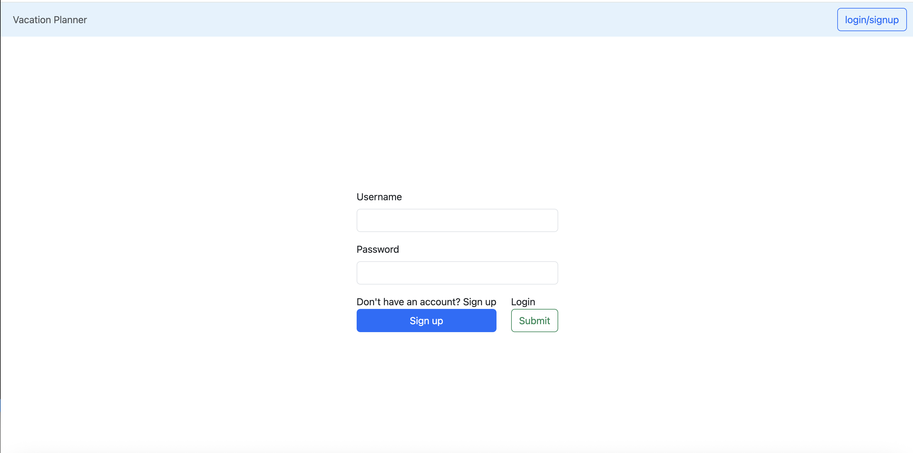
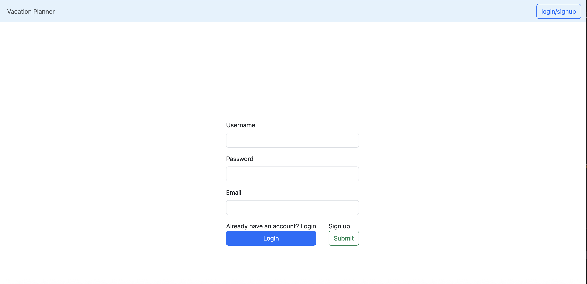
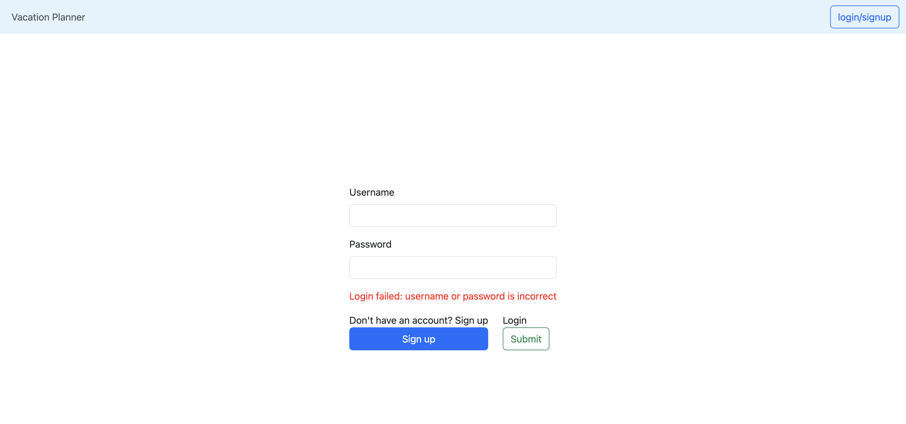
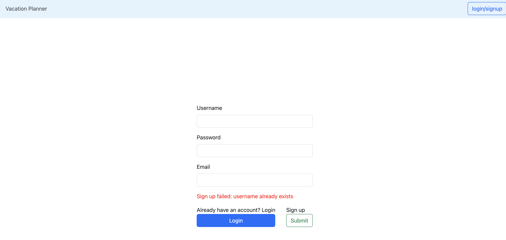
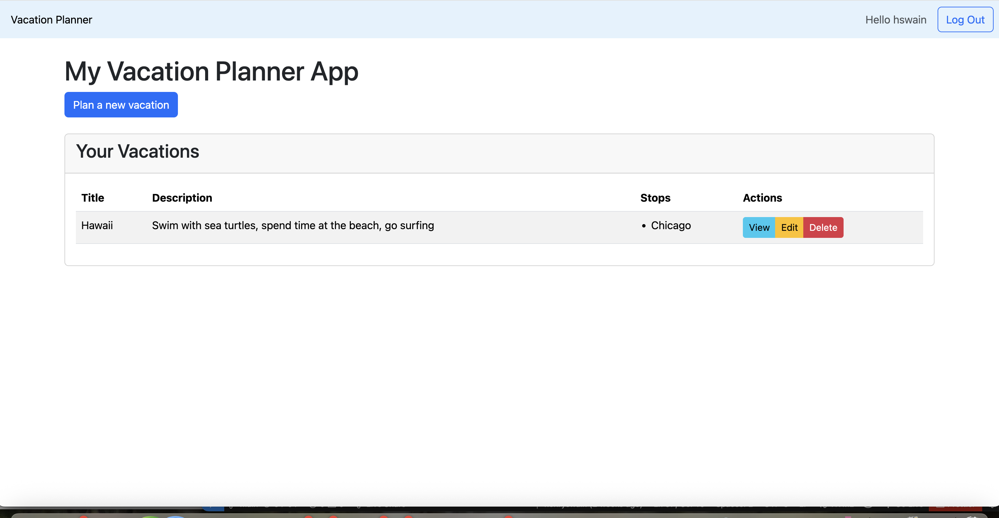
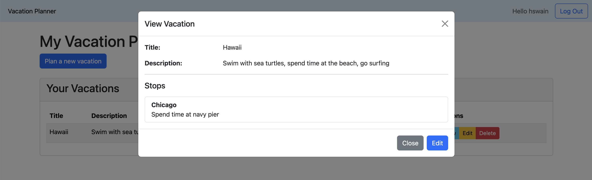
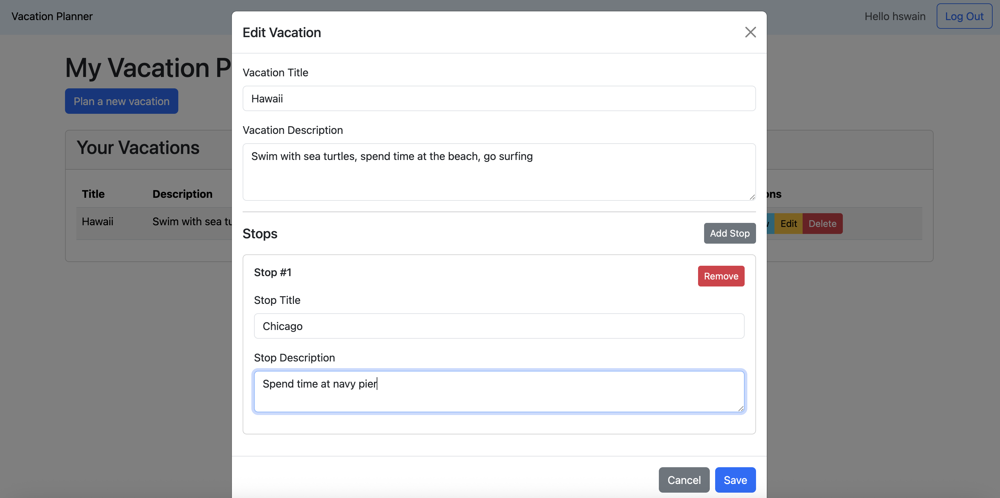
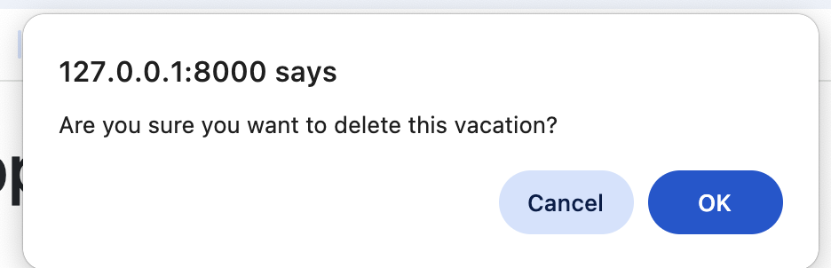

# This application is a CRUD vacation planner application
screenshot of login screen.

screenshot of sign up screen.

screenshots of error user will see if they try to login with invalid credentials.

screenshot of error user will see if they try to sign up with a username that already exists.

Screenshot of vacation planner with 1 planned vacation.

Screenshot of viewing vacation.

Screenshot of editing vacation. It is the same as when creating new vacation.

screenshot of alert popup when attempting to delete vacation.

## To run the application:
First open a terminal window and navigate to the root directory.

Then, run `python3 -m venv venv` to create the virtual environment to prevent version conflicts.

Then, run `source ./venv/bin/activate` to activate the virtual environment.

Once inside the virtually environment, run `pip install -r backend/requirements.txt` to install the necessary dependencies to run the application.

Then navigate to the backend directory by running `cd backend`

Finally, run `uvicorn main:app --reload` to run the application. Press command+click on the port number to view the app in the brower.