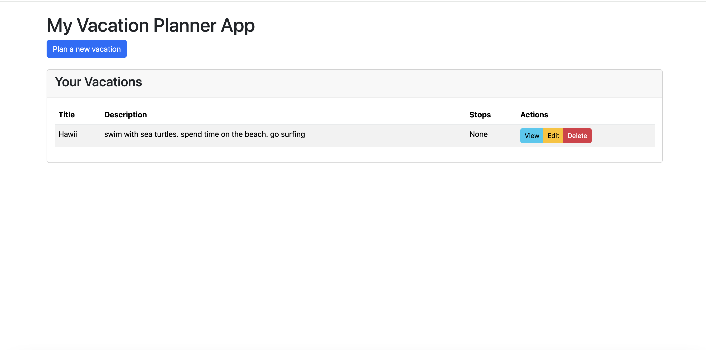
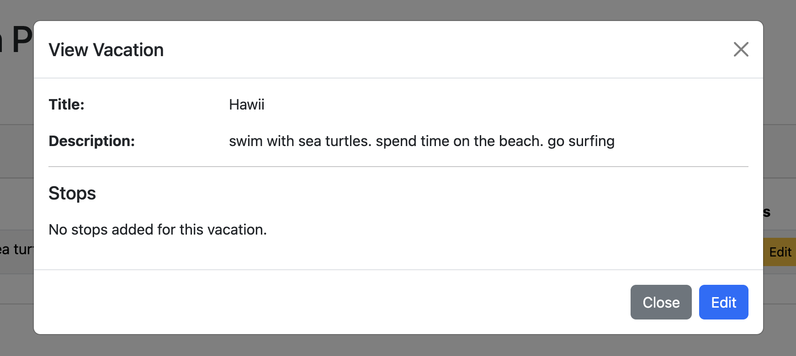
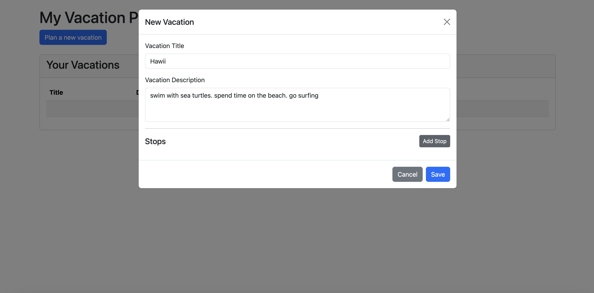
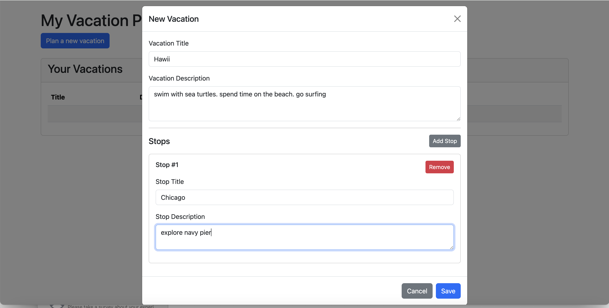

# This application is a CRUD vacation planner application

Screenshot of vacation planner with 1 planned vacation.

Screenshot of viewing vacation when no stops have been added.

Screenshot of editing vacation when no stops have been added. It is the same as when creating new vacation.

Screenshot of editing vacation when stop has been added. It is the same as when creating new vacation.

screenshot of alert popup when attempting to delete vacation.

## To run the application:

First open a terminal window and navigate to the root directory.

Then, run `python3 -m venv venv` to create the virtual environment to prevent version conflicts.

Then, run `source ./venv/bin/activate` to activate the virtual environment.

Once inside the virtually environment, run `pip install uvicorn fastapi` to install the necessary dependencies to run the application.

Finally, run `uvicorn main:app` to run the application. Press command+click on the port number to view the app in the brower.